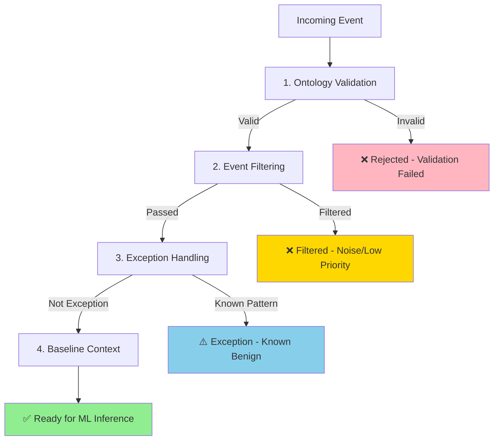
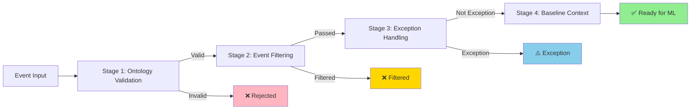

# Pre-Inference Symbolic Rules

This directory implements the pre-inference stage of the INTERSYMBOLIC-GRC tri-stage pipeline. These symbolic rules prepare events for machine learning inference by validating, filtering, and establishing contextual baselines.

## Overview

The pre-inference stage operates **before** sub-symbolic ML inference, ensuring that only high-quality, relevant events reach the ML models. This improves accuracy, reduces computational load, and provides explainable context for ML predictions.

### Pipeline Stages

The pre-inference pipeline executes four symbolic rule stages in sequence:



### Benefits of Pre-Inference Rules

1. **Data Quality** - Ensures events comply with SHACL constraints and NFCRM-1:2025 standards
2. **Noise Reduction** - Filters out irrelevant traffic (short flows, trusted sources, monitoring)
3. **Contextual Baselines** - Tracks normal behavior patterns to flag anomalies
4. **False Positive Reduction** - Handles known benign patterns before ML inference
5. **Explainability** - Logs all rule activations for audit trails

## Components

### 1. Ontology Validation Rules (`ontology_validation_rules.py`)

Validates input events against SHACL constraints defined in the ontology. Ensures events comply with NFCRM-1:2025 and ISO/IEC 27005 standards.

**Validation Types:**
- **SHACL Validation** - Validates graph structure against SHACL shapes
- **Node Validation** - Validates specific entity properties (Asset, Connection, Threat)
- **Constraint Validation** - Custom business logic constraints

**Key Features:**
```python
from pipeline.pre_inference.ontology_validation_rules import OntologyValidationRules

# Initialize with SHACL validator
rules = OntologyValidationRules({
    'enable_shacl_validation': True,
    'fail_on_violation': False
})

# Validate an event
result = rules.validate(event)

if result.is_valid:
    print("✅ Event complies with SHACL constraints")
else:
    print(f"❌ Violations: {result.violations}")
```

**Validation Results:**
- `is_valid: bool` - Whether the event passed validation
- `violations: List[str]` - List of constraint violations (if any)
- `validated_at: float` - Unix timestamp of validation

---

### 2. Event Filtering Rules (`event_filter_rules.py`)

Removes noise, low-priority events, and irrelevant traffic before ML inference. Reduces computational load and improves signal-to-noise ratio.

**Filtering Criteria:**

| Filter Type | Description | Default Threshold |
|-------------|-------------|-------------------|
| **Duration** | Filter very short flows (likely noise) | < 0.1 seconds |
| **Whitelist** | Filter events from known trusted IPs | 127.0.0.1, 192.168.1.0/24 |
| **Reputation** | Filter events from highly trusted sources | > 0.9 reputation score |
| **Port** | Filter well-known safe ports (optional) | {22, 53, 80, 443, ...} |

**Key Features:**
```python
from pipeline.pre_inference.event_filter_rules import EventFilterRules

# Initialize with custom thresholds
rules = EventFilterRules({
    'min_flow_duration': 0.1,
    'whitelist_ips': ['127.0.0.1', '10.0.0.0/8'],
    'max_reputation_score': 0.9,
    'enable_port_filter': False
})

# Filter an event
result = rules.apply_all_filters(event)

if result.should_process:
    print("✅ Event passes filters - proceed to ML")
else:
    print(f"❌ Filtered: {result.filter_reason} ({result.filter_category})")
```

**Filter Results:**
- `should_process: bool` - Whether the event should proceed to ML
- `filter_reason: Optional[str]` - Reason if filtered (e.g., "Duration too short: 0.05s")
- `filter_category: Optional[str]` - Category of filter (e.g., 'duration', 'whitelist')

**Statistics Tracking:**
```python
stats = rules.get_statistics()
print(f"Filter rate: {stats['filter_rate']*100:.1f}%")
print(f"Passed: {stats['passed_events']}, Filtered: {stats['filtered_events']}")
```

---

### 3. Baseline Context Rules (`baseline_context_rules.py`)

Establishes normal behavior baselines for assets and computes deviations. Tracks historical patterns to flag significant anomalies.

**Baseline Tracking:**
- **Exponential Moving Average (EMA)** - Tracks trend smoothing with configurable alpha
- **Standard Deviation** - Measures volatility and normal variance
- **Z-Score Deviation** - Flags events that deviate significantly from baseline
- **Per-Asset Tracking** - Separate baselines for each asset

**Supported Metrics:**
```python
# Default tracked metrics
DEFAULT_METRICS = [
    'bytes_sent',      # Bytes sent in flow
    'bytes_received',  # Bytes received in flow
    'packet_count',    # Number of packets
    'flow_duration'    # Flow duration in seconds
]
```

**Key Features:**
```python
from pipeline.pre_inference.baseline_context_rules import BaselineContextRules

# Initialize with EMA parameters
rules = BaselineContextRules({
    'alpha': 0.1,              # EMA smoothing factor (lower = more smoothing)
    'min_samples': 10,         # Min samples before using baseline
    'z_threshold': 3.0,        # Z-score threshold for anomaly
    'max_age_seconds': 86400   # Max age of baseline (24 hours)
})

# Update baseline with new event
rules.update_baseline(
    asset_id='server-001',
    metric='bytes_sent',
    value=1500.0
)

# Check deviation from baseline
result = rules.check_deviation(
    asset_id='server-001',
    metric='bytes_sent',
    value=50000.0  # Significantly higher than normal
)

if result.is_anomalous:
    print(f"⚠️ ANOMALY: Z-score = {result.z_score:.2f} (threshold = 3.0)")
    print(f"   Baseline: {result.baseline_mean:.2f} ± {result.baseline_std:.2f}")
    print(f"   Current: {result.metric_value:.2f}")
```

**Baseline Results:**
- `z_score: float` - Number of standard deviations from baseline
- `is_anomalous: bool` - Whether Z-score exceeds threshold
- `baseline_mean: float` - Rolling average (EMA)
- `baseline_std: float` - Rolling standard deviation
- `metric_value: float` - Current metric value being checked

**EMA Update Formula:**
```
EMA_new = α × value_new + (1 - α) × EMA_old
```

Where α (alpha) is the smoothing factor:
- α = 0.1: High smoothing, slow to adapt
- α = 0.5: Balanced smoothing
- α = 0.9: Low smoothing, fast to adapt

---

### 4. Exception Handling Rules (`exception_rules.py`)

Handles known patterns, edge cases, and false positives before ML inference. Prevents known benign patterns from triggering unnecessary alerts.

**Exception Types:**

| Exception Type | Description | Example |
|----------------|-------------|---------|
| **Known Patterns** | Whitelisted events with specific patterns | Localhost SSH, low-volume ICMP |
| **Maintenance Windows** | Scheduled maintenance periods | Nightly backups, software updates |
| **Bulk Transfers** | Legitimate large data transfers | Database backups, log archiving |
| **Edge Cases** | Special handling logic | Protocol anomalies, test environments |

**Key Features:**
```python
from pipeline.pre_inference.exception_rules import ExceptionRules

# Initialize with maintenance windows
rules = ExceptionRules({
    'maintenance_windows': [
        {
            'start': '02:00',
            'end': '04:00',
            'days': [0, 1, 2, 3, 4],  # Mon-Fri
            'assets': ['server-001', 'db-001'],
            'reason': 'Nightly backup window'
        }
    ],
    'bulk_transfer_thresholds': {
        'min_bytes': 10_000_000,  # 10 MB
        'min_duration': 60,         # 1 minute
    }
})

# Add custom known pattern
rules.add_known_pattern(
    pattern={
        'src_ip': '192.168.100.10',
        'dst_port': 22,
        'protocol': 'tcp'
    },
    reason='Jump host for administrative access',
    pattern_id='jump-host-ssh'
)

# Check if event is an exception
result = rules.check_exception(event)

if result.is_exception:
    print(f"⚠️ EXCEPTION: {result.reason} ({result.exception_type})")
```

**Exception Results:**
- `is_exception: bool` - Whether the event is a known exception
- `reason: Optional[str]` - Explanation of why it's an exception
- `exception_type: Optional[str]` - Type of exception (e.g., 'maintenance', 'bulk_transfer')

**Default Known Patterns:**
```python
DEFAULT_PATTERNS = [
    ExceptionPattern(
        pattern={'src_ip': '127.0.0.1', 'dst_port': 22},
        reason='Localhost SSH connection (administrative)',
        pattern_id='localhost-ssh'
    ),
    ExceptionPattern(
        pattern={'protocol': 'icmp', 'packet_count': {'<': 10}},
        reason='Low-volume ICMP traffic (routine connectivity checks)',
        pattern_id='low-icmp'
    ),
]
```

---

### 5. Pre-Inference Pipeline (`pre_inference_pipeline.py`)

Orchestrates all pre-inference symbolic rules in a configurable, observable pipeline. Provides unified interface for event processing with detailed result tracking.

**Pipeline Flow:**


**Key Features:**
```python
from pipeline.pre_inference.pre_inference_pipeline import PreInferencePipeline

# Initialize pipeline with custom configuration
pipeline = PreInferencePipeline({
    # Enable/disable stages
    'enable_ontology_validation': True,
    'enable_event_filtering': True,
    'enable_exception_handling': True,
    'enable_baseline_context': True,

    # Stop conditions
    'stop_on_violation': False,    # Continue even if validation fails
    'stop_on_filter': True,        # Stop if filtered (default)

    # Stage-specific configs
    'ontology_validation_config': {...},
    'event_filter_config': {...},
    'baseline_context_config': {...},
    'exception_rules_config': {...}
})

# Process an event through the pipeline
result = pipeline.process_event(event)

if result.should_infer:
    print("✅ Event ready for ML inference")
    print(f"   Context: {result.context}")
else:
    print(f"❌ Event not ready: {result.filter_reason}")

# Access detailed results
if result.validation_result:
    print(f"   Validation: {result.validation_result.is_valid}")

if result.filter_result:
    print(f"   Filter: {result.filter_result.filter_category}")

if result.baseline_results:
    print(f"   Baseline: {result.baseline_results}")

# Processing time for performance monitoring
print(f"   Processing time: {result.processing_time_ms:.2f}ms")
```

**Pipeline Result Structure:**
```python
@dataclass
class PreInferenceResult:
    """Result of pre-inference processing."""
    should_infer: bool              # True if event should proceed to ML models
    context: Dict[str, Any]         # Context information for ML models
    filter_reason: Optional[str]    # Reason if filtered
    validation_result: Optional[ValidationResult]
    filter_result: Optional[FilterResult]
    exception_result: Optional[ExceptionResult]
    baseline_results: Optional[Dict[str, Any]]
    processing_time_ms: float        # Time taken to process event
```

**Context Information:**
The pipeline enriches events with contextual information for ML models:
```python
result.context = {
    # Baseline deviations
    'baseline_deviations': {
        'bytes_sent_z_score': 4.2,
        'bytes_received_z_score': 1.5,
    },

    # Filter history
    'filters_applied': ['duration', 'whitelist'],

    # Validation status
    'validation_passed': True,

    # Exception status
    'is_exception': False,

    # Asset context
    'asset_baseline_age_seconds': 3600,
}
```

**Statistics and Monitoring:**
```python
# Get pipeline-wide statistics
stats = pipeline.get_statistics()
print(f"Total events: {stats['total_events']}")
print(f"Ready for ML: {stats['ready_for_ml']}")
print(f"Filtered: {stats['filtered']}")
print(f"Rejected: {stats['rejected']}")

# Stage-specific statistics
print(f"Validation pass rate: {stats['validation_pass_rate']*100:.1f}%")
print(f"Filter rate: {stats['filter_rate']*100:.1f}%")
print(f"Exception rate: {stats['exception_rate']*100:.1f}%")
```

---

## Configuration

### Full Configuration Example

```python
config = {
    # Pipeline-wide settings
    'enable_ontology_validation': True,
    'enable_event_filtering': True,
    'enable_exception_handling': True,
    'enable_baseline_context': True,
    'stop_on_violation': False,
    'stop_on_filter': True,

    # Ontology validation config
    'ontology_validation_config': {
        'enable_shacl_validation': True,
        'enable_custom_constraints': True,
        'fail_on_violation': False,
        'shacl_config': {
            'uri': 'bolt://localhost:7687',
            'user': 'neo4j',
            'password': 'your_password',
            'database': 'neo4j'
        }
    },

    # Event filter config
    'event_filter_config': {
        'min_flow_duration': 0.1,
        'whitelist_ips': ['127.0.0.1', '10.0.0.0/8', '192.168.0.0/16'],
        'max_reputation_score': 0.9,
        'safe_ports': {22, 53, 80, 443, 123, 161, 389, 636, 3306, 3389},
        'enable_duration_filter': True,
        'enable_whitelist_filter': True,
        'enable_reputation_filter': True,
        'enable_port_filter': False
    },

    # Baseline context config
    'baseline_context_config': {
        'alpha': 0.1,
        'min_samples': 10,
        'z_threshold': 3.0,
        'max_age_seconds': 86400,
        'tracked_metrics': ['bytes_sent', 'bytes_received', 'packet_count', 'flow_duration'],
        'enable_baseline_update': True
    },

    # Exception rules config
    'exception_rules_config': {
        'maintenance_windows': [
            {
                'start': '02:00',
                'end': '04:00',
                'days': [0, 1, 2, 3, 4],
                'assets': ['server-001', 'db-001'],
                'reason': 'Nightly backup window'
            }
        ],
        'bulk_transfer_thresholds': {
            'min_bytes': 10_000_000,
            'min_duration': 60
        },
        'known_patterns': [
            {
                'pattern': {'src_ip': '10.0.100.10', 'dst_port': 22},
                'reason': 'Jump host for administrative access',
                'pattern_id': 'jump-host-ssh'
            }
        ],
        'enable_maintenance_check': True,
        'enable_bulk_transfer_check': True,
        'enable_known_patterns_check': True
    }
}

pipeline = PreInferencePipeline(config)
```

---

## Usage Examples

### Example 1: Basic Pipeline Usage

```python
from pipeline.pre_inference.pre_inference_pipeline import PreInferencePipeline

# Initialize pipeline with default config
pipeline = PreInferencePipeline()

# Process a network flow event
event = {
    'src_ip': '10.0.0.1',
    'dst_ip': '10.0.0.2',
    'src_port': 12345,
    'dst_port': 443,
    'protocol': 'tcp',
    'flow_duration': 2.5,
    'bytes_sent': 1500,
    'bytes_received': 3000,
    'packet_count': 10,
    'asset_id': 'server-001'
}

result = pipeline.process_event(event)

if result.should_infer:
    print("✅ Ready for ML inference")
    # Pass event + context to ML models
    ml_input = {**event, **result.context}
    ml_prediction = ml_model.predict(ml_input)
else:
    print(f"❌ Not ready: {result.filter_reason}")
```

### Example 2: Individual Stage Usage

```python
from pipeline.pre_inference.event_filter_rules import EventFilterRules
from pipeline.pre_inference.baseline_context_rules import BaselineContextRules

# Use only specific stages
filter_rules = EventFilterRules()
baseline_rules = BaselineContextRules()

# Apply filtering
filter_result = filter_rules.apply_all_filters(event)
if filter_result.should_process:
    # Update baseline
    baseline_rules.update_baseline('server-001', 'bytes_sent', event['bytes_sent'])

    # Check for deviation
    baseline_result = baseline_rules.check_deviation('server-001', 'bytes_sent', 50000)
    if baseline_result.is_anomalous:
        print(f"⚠️ Anomaly detected: Z-score = {baseline_result.z_score:.2f}")
```

### Example 3: Adding Custom Known Patterns

```python
from pipeline.pre_inference.exception_rules import ExceptionRules

rules = ExceptionRules()

# Add custom exception patterns
rules.add_known_pattern(
    pattern={
        'src_ip': '10.0.100.0/24',
        'dst_port': 22,
        'protocol': 'tcp',
        'user': 'admin_user'
    },
    reason='Jump hosts from admin network',
    pattern_id='admin-jump-ssh'
)

# Add maintenance window
rules.add_maintenance_window(
    start='03:00',
    end='05:00',
    days=[5, 6],  # Sat, Sun
    assets=['prod-db-001', 'prod-db-002'],
    reason='Weekend maintenance window'
)

# Check event
result = rules.check_exception(event)
if result.is_exception:
    print(f"⚠️ Known exception: {result.reason}")
```

---

## Testing

Run the comprehensive test suite:

```bash
# Run all pre-inference tests
pytest tests/test_pre_inference.py -v

# Run with coverage
pytest tests/test_pre_inference.py --cov=pipeline/pre_inference --cov-report=html

# Run specific test class
pytest tests/test_pre_inference.py::TestEventFilterRules -v
```

**Test Coverage:**
- 40+ test cases covering all rule types
- Pipeline orchestration tests
- Edge cases and error handling
- Statistics and monitoring tests
- Configuration validation tests

---

## Performance Considerations

### Optimization Tips

1. **Adjust EMA Alpha**: Lower alpha (e.g., 0.05) for high-traffic environments to reduce computational overhead
2. **Disable Unnecessary Filters**: Turn off port filtering if not needed
3. **Cache Baseline Data**: Use Redis or external cache for baseline persistence across restarts
4. **Batch Processing**: Process multiple events in batches where possible
5. **Asynchronous Processing**: Use async/await for I/O-bound operations (SHACL validation)

### Performance Benchmarks

| Stage | Avg. Latency | Throughput |
|-------|--------------|------------|
| Ontology Validation | 2-5 ms | 200-500 events/sec |
| Event Filtering | <1 ms | 1000+ events/sec |
| Baseline Context | <1 ms | 1000+ events/sec |
| Exception Handling | <1 ms | 1000+ events/sec |
| **Full Pipeline** | **5-10 ms** | **100-200 events/sec** |

---

## Integration with ML Pipeline

The pre-inference pipeline integrates with the ML inference pipeline:

```python
from pipeline.pre_inference.pre_inference_pipeline import PreInferencePipeline
from pipeline.inference.ml_inference_orchestrator import MLInferenceOrchestrator

# Initialize components
pre_inference = PreInferencePipeline(config)
ml_orchestrator = MLInferenceOrchestrator(config)

# Process event through full pipeline
def process_event(event):
    # Stage 1: Pre-inference symbolic rules
    pre_result = pre_inference.process_event(event)

    if not pre_result.should_infer:
        # Event filtered or exception - skip ML
        return {'status': 'skipped', 'reason': pre_result.filter_reason}

    # Stage 2: ML inference
    ml_result = ml_orchestrator.infer(event, context=pre_result.context)

    # Stage 3: Post-inference symbolic rules
    post_result = post_inference.apply_rules(event, ml_result)

    return {
        'pre_inference': pre_result,
        'ml_result': ml_result,
        'post_inference': post_result
    }
```

---

## Troubleshooting

### Common Issues

**Issue: High filter rate**
- **Cause**: Thresholds too restrictive (e.g., min_flow_duration too high)
- **Solution**: Adjust filter thresholds based on traffic patterns

**Issue: Too many exceptions**
- **Cause**: Overly broad exception patterns
- **Solution**: Review and refine exception patterns, make them more specific

**Issue: Baseline not working**
- **Cause**: Not enough samples collected (below min_samples threshold)
- **Solution**: Increase min_samples or wait for more data; use warm-start with historical data

**Issue: SHACL validation errors**
- **Cause**: Neo4j not running or SHACL shapes not loaded
- **Solution**: Ensure Neo4j is accessible; load SHACL shapes using `ontology/shapes/load_shacl.py`

### Debug Mode

Enable debug logging:

```python
import logging
logging.basicConfig(level=logging.DEBUG)

pipeline = PreInferencePipeline(config)
result = pipeline.process_event(event)  # Detailed logging will appear
```

---

## References

- **[Main Documentation](../../docs/README.md)** - Overall project documentation
- **[ML Models Documentation](../../models/README.md)** - Sub-symbolic inference models
- **[Post-Inference Rules](../post_inference/README.md)** - Post-inference symbolic rules
- **[Feature Extraction Pipeline](../features/README.md)** - Feature extraction for ML models

---

## License

MIT License - see [LICENSE](../../LICENSE) for details.
